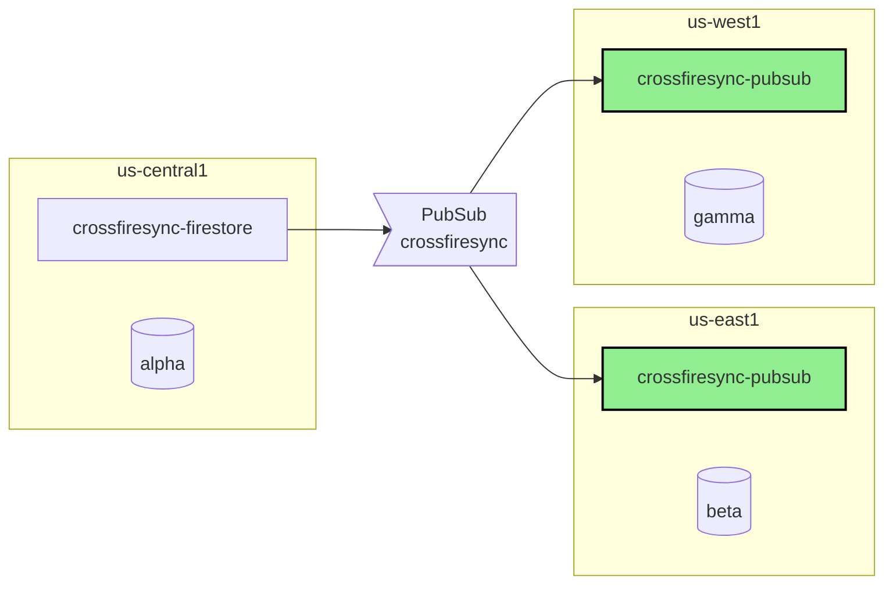
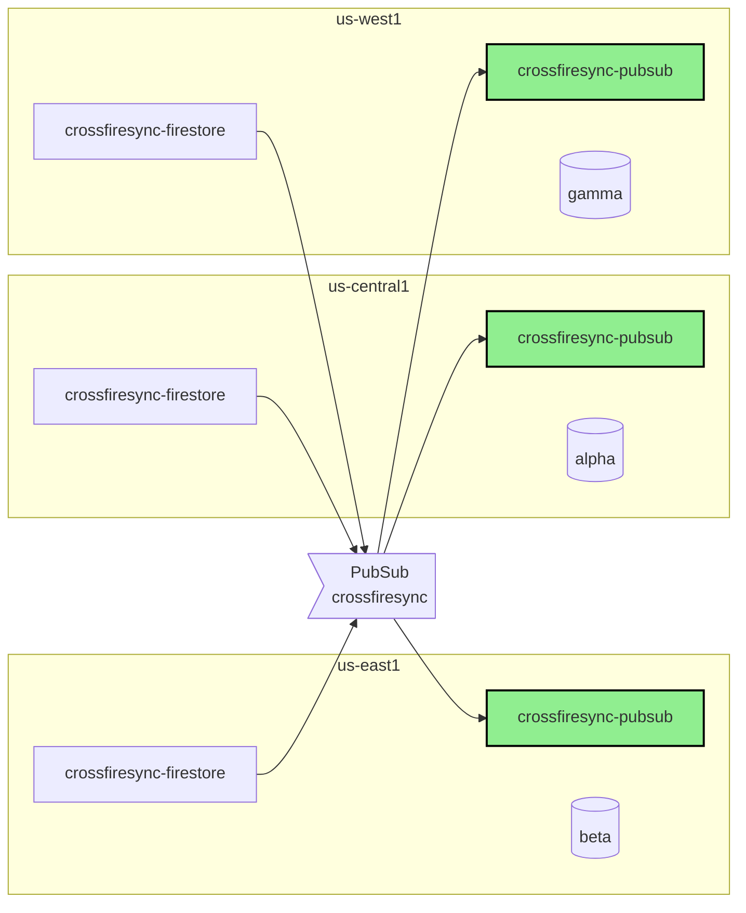

[](https://opensource.org/licenses/Apache-2.0) [](https://unitvectory-labs.github.io/uvy-labs-guide/bestpractices/status/#active)

# crossfiresync-pubsub

Reference implementation of a [crossfiresync](https://github.com/UnitVectorY-Labs/crossfiresync) Pub/Sub consumer, featuring Java code and deployment scripts for Cloud Functions.

The examples in this repository assume 3 regions are used, but this is just for demonstration purposes.  Any number of regions can be used in practice.

For this example the database names are used:

- **alpha** in `us-central`
- **beta** in `us-east1`
- **gamma** in `us-west1`

The PubSub topic name for this example is `crossfiresync`.

This repository is only for deploying `crossfiresync-pubsub` the corresponding deployments of [crossfiresync-firestore](https://github.com/UnitVectorY-Labs/crossfiresync-firestore) must also be completed for replication to function.

## Single Region Primary

In this single region example `us-east1` and `us-west1` are the replica regions.



The deployment for this example requires deploying `crossfiresync-pubsub` to `us-east1` and `us-west1` as that are the replica regions

```
bash ./deploy-single-region-primary.sh us-east1 crossfiresync beta
bash ./deploy-single-region-primary.sh us-west1 crossfiresync gamma
```

## Multi Region Primary

In the multi-region example `us-east1`, `us-central1`, and `us-west1` are all able to handle writes.



The deployment for this example requires deploying `crossfiresync-pubsub` to all 3 regions.

```
bash ./deploy-multi-region-primary.sh us-central1 crossfiresync alpha
bash ./deploy-multi-region-primary.sh us-east1 crossfiresync beta
bash ./deploy-multi-region-primary.sh us-west1 crossfiresync gamma
```
